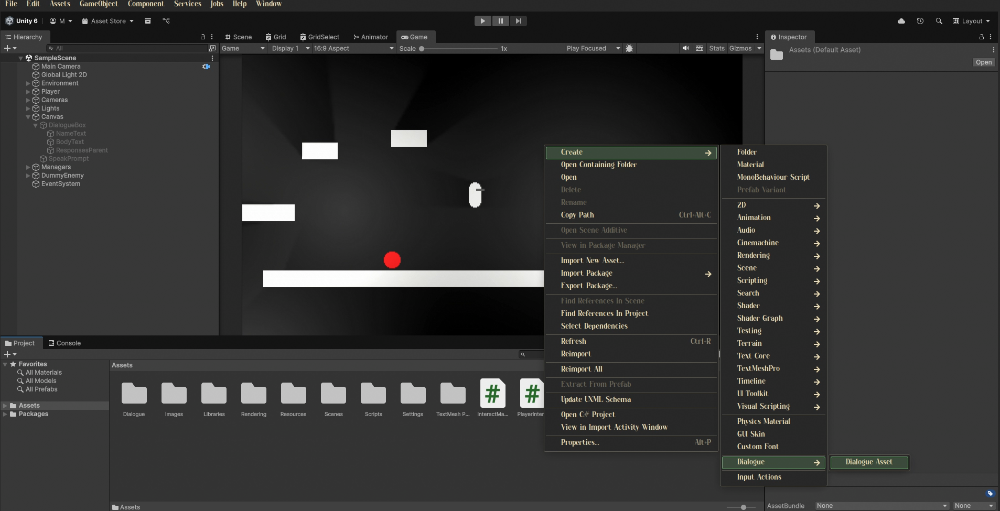
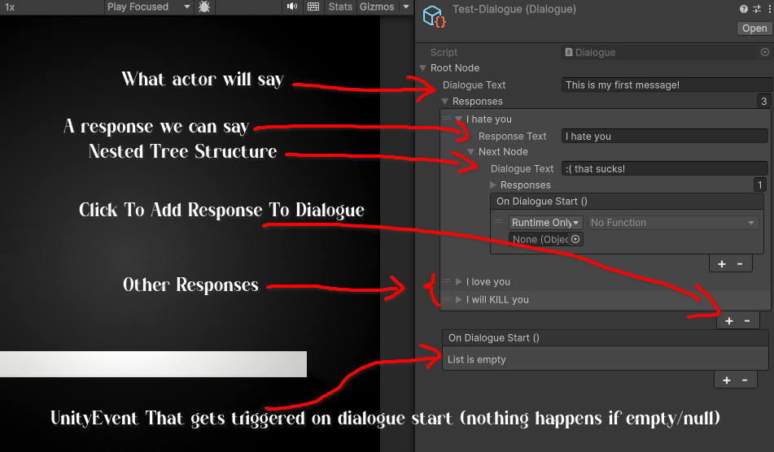

# CW2-gameDesign

## How to Create a New Dialogue Tree

## How to Write In the New Dialogue Tree

## How do I make an object interactable?

Put the Actor script on the gameobject, and specify:

- Actor's Name
- Actor's Dialogue Tree
- Position where the "Speak" / Interact Prompt will be placed

