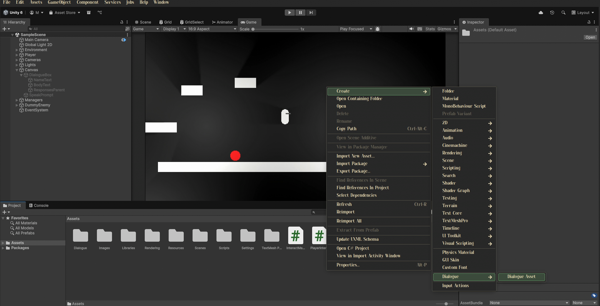
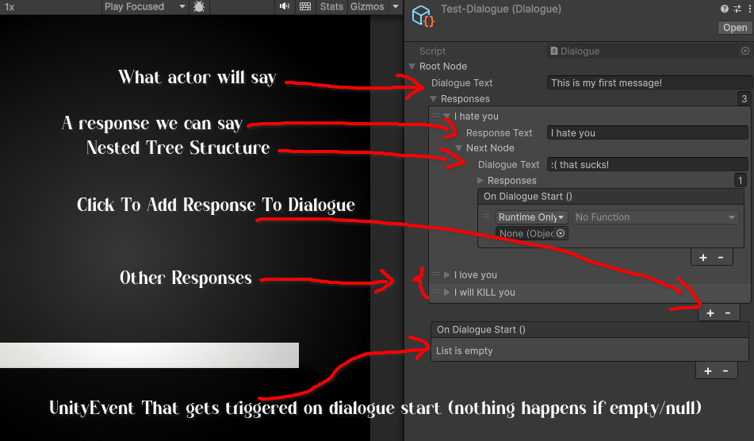

# CW2-gameDesign
Froggy Fate is a short demo of a Megolovania Style Game, with quests, boss, abilities and more!

## Backend Tools
### How to Create a New Dialogue Tree

### How to Write In the New Dialogue Tree

### How do I make an object interactable?

Put the Actor script on the gameobject, and specify:

- Actor's Name
- Actor's Dialogue Tree
- Position where the "Speak" / Interact Prompt will be placed

